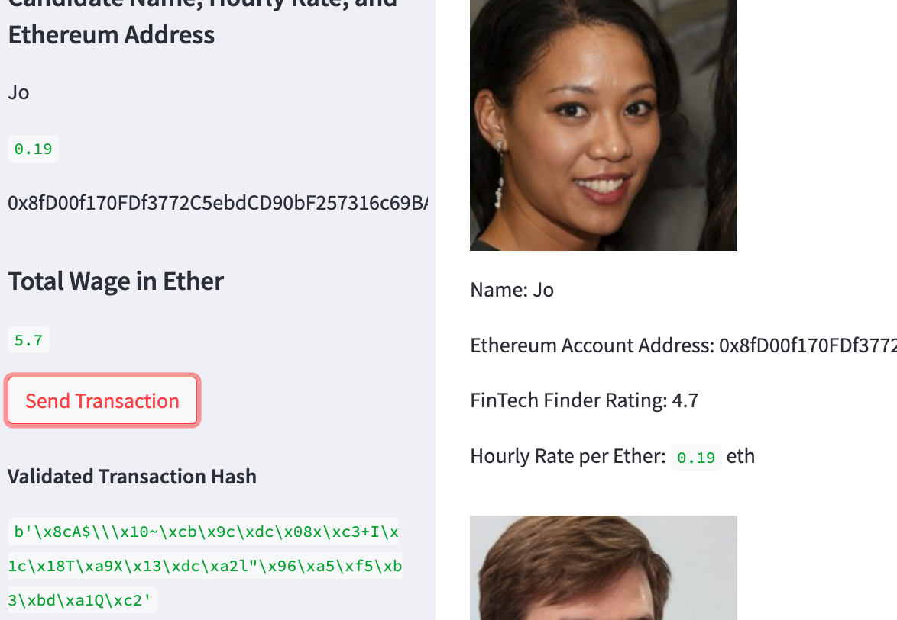
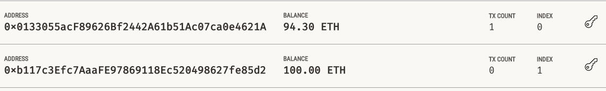
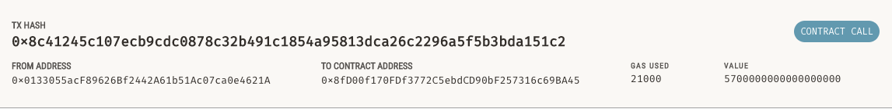

# **Ethereum_Employee_Payment_App**

The purpose of this project is to develop an application that allows users to scout out Fintech professionals to hire, and pay them a wage based on their hourly rate in ether, via the Ethereum blockchain simulator, Ganache. 

---

## **Technologies**

This program is written in python and uses the following libraries: Web3 (Account, middleware, gas_strategies), Wallet from bip44, dotenv, os, requests, streamlit, dataclasses, and typing specifically the Any and List imports. 

To run this application, the user must execute the following command within the terminal, once in the folder where the app lies: 'streamlit run fintech_finder.py'.

The application will prompt the user to review the eligble fintech professional candidates and based on their profiles, select an individual to hire as an employee and the number of hours they would like them to work. 

Upon selecting the individual and the number of hours they would like them to work, the user can send the individual a wage in ether via a transaction in Ganache. 

```python

    def send_transaction(w3, account, to, wage):
    """Send an authorized transaction to the Ganache blockchain."""
    # Set gas price strategy
    w3.eth.setGasPriceStrategy(medium_gas_price_strategy)

    # Convert eth amount to Wei
    value = w3.toWei(wage, "ether")

    # Calculate gas estimate
    gasEstimate = w3.eth.estimateGas({"to": to, "from": account.address, "value": value})

    # Construct a raw transaction
    raw_tx = {
        "to": to,
        "from": account.address,
        "value": value,
        "gas": gasEstimate,
        "gasPrice": 0,
        "nonce": w3.eth.getTransactionCount(account.address)
    }

    # Sign the raw transaction with ethereum account
    signed_tx = account.signTransaction(raw_tx)

    # Send the signed transactions
    return w3.eth.sendRawTransaction(signed_tx.rawTransaction)
```
---

## **Installation Guide**

1. First you would want to navigate to Terminal to the location where fintech_finder.py resides. Then you run in dev, 'streamlit run fintech_finder.py'.

2. You should arrive at this homepage after running the app. 


3. You can then select the employee as well as the number of hours and pay their wage via the "Send Transaction" button.



Then upon navigating to Ganache, we can see the Transaction balance. 



4. Now you can then go to the Transactions tab in Ganache to see the details of the Transaction.



---

## **Contributors**

The author of this application is Kanika Sharma with Github username kinsnik, who also goes by Niki. She can be reached at ksharmaconnect3@gmail.com or on LinkedIn under Kanika Sharma: https://www.linkedin.com/in/kanika-sharma-aa28a6134/.

---

## **License**

Users have permissions to read this file, but not write or edit the code. The code within, if used, should be properly recognized and cited as the intellectual property of the author. 
